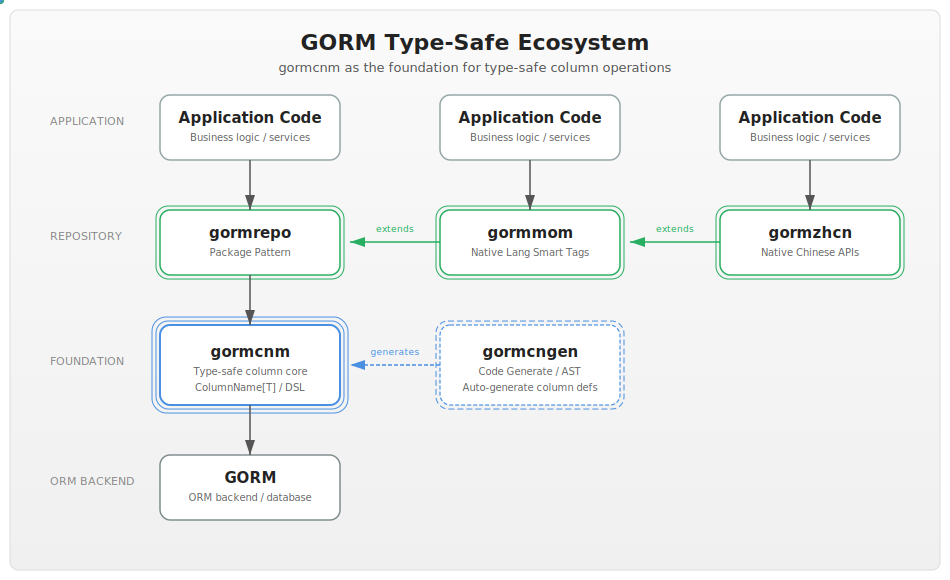

[](https://github.com/yyle88/gormcnm/actions/workflows/release.yml?query=branch%3Amain)
[](https://pkg.go.dev/github.com/yyle88/gormcnm)
[](https://coveralls.io/github/yyle88/gormcnm?branch=main)
[](https://github.com/yyle88/gormcnm)
[](https://github.com/yyle88/gormcnm/releases)
[](https://goreportcard.com/report/github.com/yyle88/gormcnm)

# GORMCNM

**gormcnm** - Eliminate hardcoded strings in GORM operations with type-safe column names and compile-time validation.

---

## Ecosystem



---

<!-- TEMPLATE (EN) BEGIN: LANGUAGE NAVIGATION -->

## CHINESE README

[中文说明](README.zh.md)
<!-- TEMPLATE (EN) END: LANGUAGE NAVIGATION -->

---

## Language Ecosystem Comparison

| Language   | ORM          | Type-Safe Columns  | Example                                 |
|------------|--------------|--------------------|-----------------------------------------|
| **Java**   | MyBatis Plus | `Example::getName` | `wrapper.eq(Example::getName, "alice")` |
| **Python** | SQLAlchemy   | `Example.name`     | `query.filter(Example.name == "alice")` |
| **Go**     | **GORMCNM**  | `cls.Name.Eq()`    | `db.Where(cls.Name.Eq("alice"))`        |

---

## Main Features

- 🎯 **Core Value**: Avoid hardcoded column names with type-safe operations
- 🎯 **Type-Safe Column Operations**: Generic `ColumnName[T]` type with compile-time validation
- ⚡ **Zero Runtime Overhead**: Type checking happens at compile time
- 🔄 **Refactor-Safe Queries**: IDE auto-completion and automatic refactoring support
- 🌍 **Rich Gorm Operations**: Comprehensive comparison, range, pattern, and aggregate operations
- 📋 **Ecosystem Foundation**: Powers code generation and repo pattern tools

---

## Installation

```bash
go get github.com/yyle88/gormcnm
```

---

## 🔥 Quick Start Example

```go
package main

import (
	"fmt"

	"github.com/google/uuid"
	"github.com/yyle88/done"
	"github.com/yyle88/gormcnm"
	"github.com/yyle88/neatjson/neatjsons"
	"github.com/yyle88/rese"
	"gorm.io/driver/sqlite"
	"gorm.io/gorm"
	"gorm.io/gorm/logger"
)

type Account struct {
	Username string `gorm:"primary_key;type:varchar(100);"`
	Nickname string `gorm:"column:nickname;"`
	Age      int    `gorm:"column:age;"`
}

const (
	columnUsername = gormcnm.ColumnName[string]("username")
	columnNickname = gormcnm.ColumnName[string]("nickname")
	columnAge      = gormcnm.ColumnName[int]("age")
)

func main() {
	dsn := fmt.Sprintf("file:db-%s?mode=memory&cache=shared", uuid.New().String())
	db := rese.P1(gorm.Open(sqlite.Open(dsn), &gorm.Config{
		Logger: logger.Default.LogMode(logger.Info),
	}))
	defer rese.F0(rese.P1(db.DB()).Close)

	//CREATE TABLE `accounts` (`username` varchar(100),`nickname` text,`age` integer,PRIMARY KEY (`username`))
	done.Done(db.AutoMigrate(&Account{}))
	//INSERT INTO `accounts` (`username`,`nickname`,`age`) VALUES ("alice","Alice",17)
	done.Done(db.Create(&Account{Username: "alice", Nickname: "Alice", Age: 17}).Error)

	//SELECT * FROM `accounts` WHERE username="alice" ORDER BY `accounts`.`username` LIMIT 1
	var account Account
	done.Done(db.Where(columnUsername.Eq("alice")).First(&account).Error)
	fmt.Println(neatjsons.S(account))

	//UPDATE `accounts` SET `nickname`="Alice-2" WHERE `username` = "alice"
	done.Done(db.Model(&account).Update(columnNickname.Kv("Alice-2")).Error)
	//SELECT * FROM `accounts` WHERE username="alice" ORDER BY `accounts`.`username` LIMIT 1
	done.Done(db.Where(columnUsername.Eq("alice")).First(&account).Error)
	fmt.Println(neatjsons.S(account))

	//UPDATE `accounts` SET `age`=18,`nickname`="Alice-3" WHERE `username` = "alice"
	done.Done(db.Model(&account).Updates(columnNickname.Kw("Alice-3").Kw(columnAge.Kv(18)).AsMap()).Error)
	//SELECT * FROM `accounts` WHERE username="alice" ORDER BY `accounts`.`username` LIMIT 1
	done.Done(db.Where(columnUsername.Eq("alice")).First(&account).Error)
	fmt.Println(neatjsons.S(account))

	//UPDATE `accounts` SET `age`=age + 1 WHERE `username` = "alice"
	done.Done(db.Model(&account).Update(columnAge.KeAdd(1)).Error)
	//SELECT * FROM `accounts` WHERE username="alice" ORDER BY `accounts`.`username` LIMIT 1
	done.Done(db.Where(columnUsername.Eq("alice")).First(&account).Error)
	fmt.Println(neatjsons.S(account))
}
```

⬆️ **Source:** [Source](internal/demos/demo1x/main.go)

---

## 🔥 Advanced Queries Example

```go
package main

import (
	"fmt"

	"github.com/google/uuid"
	"github.com/yyle88/gormcnm"
	"github.com/yyle88/must"
	"github.com/yyle88/rese"
	"gorm.io/driver/sqlite"
	"gorm.io/gorm"
	"gorm.io/gorm/logger"
)

// Example is a gorm model define 3 fields(name, type, rank)
type Example struct {
	Name string `gorm:"primary_key;type:varchar(100);"`
	Type string `gorm:"column:type;"`
	Rank int    `gorm:"column:rank;"`
}

// Now define the fields enum vars(name, type rank)
const (
	columnName = gormcnm.ColumnName[string]("name")
	columnType = gormcnm.ColumnName[string]("type")
	columnRank = gormcnm.ColumnName[int]("rank")
)

func main() {
	//new db connection
	dsn := fmt.Sprintf("file:db-%s?mode=memory&cache=shared", uuid.New().String())
	db := rese.P1(gorm.Open(sqlite.Open(dsn), &gorm.Config{
		Logger: logger.Default.LogMode(logger.Info),
	}))
	defer rese.F0(rese.P1(db.DB()).Close)

	//create example data
	must.Done(db.AutoMigrate(&Example{}).Error)
	must.Done(db.Save(&Example{Name: "abc", Type: "xyz", Rank: 123}).Error)
	must.Done(db.Save(&Example{Name: "aaa", Type: "xxx", Rank: 456}).Error)

	{
		//SELECT * FROM `examples` WHERE name="abc" ORDER BY `examples`.`name` LIMIT 1
		var res Example
		must.Done(db.Where("name=?", "abc").First(&res).Error)
		fmt.Println(res)
	}
	{
		//SELECT * FROM `examples` WHERE name="abc" AND type="xyz" AND rank>100 AND rank<200 ORDER BY `examples`.`name` LIMIT 1
		var res Example
		must.Done(db.Where(columnName.Eq("abc")).
			Where(columnType.Eq("xyz")).
			Where(columnRank.Gt(100)).
			Where(columnRank.Lt(200)).
			First(&res).Error)
		fmt.Println(res)
	}
}
```

⬆️ **Source:** [Source](internal/demos/demo2x/main.go)

---

## Core API

The `ColumnName[T]` generic type provides type-safe SQL operations:

```go
type ColumnName[T any] string
```

### Comparison Operations

```go
db.Where(columnAge.Eq(25))       // =
db.Where(columnAge.Ne(25))       // !=
db.Where(columnAge.Gt(18))       // >
db.Where(columnAge.Gte(18))      // >=
db.Where(columnAge.Lt(65))       // <
db.Where(columnAge.Lte(65))      // <=
```

### Range and Pattern Operations

| Method          | SQL               | Example                   |
|-----------------|-------------------|---------------------------|
| `Between(a, b)` | `BETWEEN a AND b` | `cls.Age.Between(18, 65)` |
| `In(values)`    | `IN (...)`        | `cls.ID.In([]int{1,2,3})` |
| `Like(pattern)` | `LIKE pattern`    | `cls.Name.Like("A%")`     |
| `IsNull()`      | `IS NULL`         | `cls.DeletedAt.IsNull()`  |
| `IsNotNull()`   | `IS NOT NULL`     | `cls.Email.IsNotNull()`   |

### Update Operations

| Method      | Description          | Example                                                      |
|-------------|----------------------|--------------------------------------------------------------|
| `Kv(value)` | Single field update  | `db.Model(&user).Update(cls.Age.Kv(26))`                     |
| `Kw(value)` | Build update map     | `cls.Age.Kw(26).Kw(cls.Email.Kv("new@example.com")).AsMap()` |
| `KeAdd(n)`  | Expression: add      | `db.Model(&user).Update(cls.Age.KeAdd(1))`                   |
| `KeSub(n)`  | Expression: subtract | `db.Model(&user).Update(cls.Score.KeSub(10))`                |

### Aggregates and Ordering

| Method          | SQL                      | Example                            |
|-----------------|--------------------------|------------------------------------|
| `Count(alias)`  | `COUNT(column) AS alias` | `db.Select(cls.ID.Count("total"))` |
| `Ob(direction)` | `ORDER BY`               | `db.Order(cls.Age.Ob("asc").Ox())` |

---

## Extension Packages

This package includes extension sub-packages for specialized database operations:

- 📦 **gormcnmjson** - Type-safe JSON column operations (SQLite JSON functions support)

**Future Extensions** (planned):

| Package        | Purpose                | Status  |
|----------------|------------------------|---------|
| gormcnmtext    | Text search operations | Planned |
| gormcnmdate    | Date/time operations   | Planned |
| gormcnmmath    | Math operations        | Planned |

---

## Related Projects

Explore the complete GORM ecosystem with these integrated packages:

### Core Ecosystem

- **[gormcnm](https://github.com/yyle88/gormcnm)** - GORM foundation providing type-safe column operations and query builders (this project)
- **[gormcngen](https://github.com/yyle88/gormcngen)** - Code generation tool using AST for type-safe GORM operations
- **[gormrepo](https://github.com/yyle88/gormrepo)** - Repository pattern implementation with GORM best practices
- **[gormmom](https://github.com/yyle88/gormmom)** - Native language GORM tag generation engine with smart column naming
- **[gormzhcn](https://github.com/go-zwbc/gormzhcn)** - Complete Chinese programming interface with GORM

Each package targets different aspects of GORM development, from localization to type safety and code generation.

---

<!-- TEMPLATE (EN) BEGIN: STANDARD PROJECT FOOTER -->
<!-- VERSION 2025-11-25 03:52:28.131064 +0000 UTC -->

## 📄 License

MIT License - see [LICENSE](LICENSE).

---

## 💬 Contact & Feedback

Contributions are welcome! Report bugs, suggest features, and contribute code:

- 🐛 **Mistake reports?** Open an issue on GitHub with reproduction steps
- 💡 **Fresh ideas?** Create an issue to discuss
- 📖 **Documentation confusing?** Report it so we can improve
- 🚀 **Need new features?** Share the use cases to help us understand requirements
- ⚡ **Performance issue?** Help us optimize through reporting slow operations
- 🔧 **Configuration problem?** Ask questions about complex setups
- 📢 **Follow project progress?** Watch the repo to get new releases and features
- 🌟 **Success stories?** Share how this package improved the workflow
- 💬 **Feedback?** We welcome suggestions and comments

---

## 🔧 Development

New code contributions, follow this process:

1. **Fork**: Fork the repo on GitHub (using the webpage UI).
2. **Clone**: Clone the forked project (`git clone https://github.com/yourname/repo-name.git`).
3. **Navigate**: Navigate to the cloned project (`cd repo-name`)
4. **Branch**: Create a feature branch (`git checkout -b feature/xxx`).
5. **Code**: Implement the changes with comprehensive tests
6. **Testing**: (Golang project) Ensure tests pass (`go test ./...`) and follow Go code style conventions
7. **Documentation**: Update documentation to support client-facing changes
8. **Stage**: Stage changes (`git add .`)
9. **Commit**: Commit changes (`git commit -m "Add feature xxx"`) ensuring backward compatible code
10. **Push**: Push to the branch (`git push origin feature/xxx`).
11. **PR**: Open a merge request on GitHub (on the GitHub webpage) with detailed description.

Please ensure tests pass and include relevant documentation updates.

---

## 🌟 Support

Welcome to contribute to this project via submitting merge requests and reporting issues.

**Project Support:**

- ⭐ **Give GitHub stars** if this project helps you
- 🤝 **Share with teammates** and (golang) programming friends
- 📝 **Write tech blogs** about development tools and workflows - we provide content writing support
- 🌟 **Join the ecosystem** - committed to supporting open source and the (golang) development scene

**Have Fun Coding with this package!** 🎉🎉🎉

<!-- TEMPLATE (EN) END: STANDARD PROJECT FOOTER -->

---

## 📈 GitHub Stars

[](https://starchart.cc/yyle88/gormcnm)
